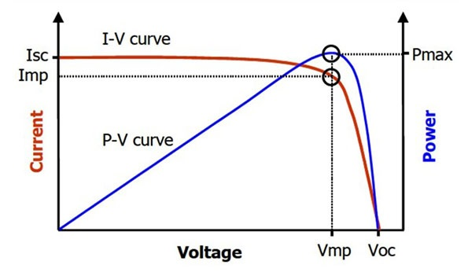
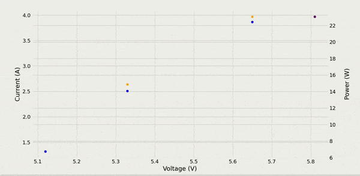

# MPPT Live Data Plot

For my capstone final project in Electrical Engineering at The University of Western Ontario, my team and I made a Maximum Power Point Tracker for a solar powered drone. The firmware for the MPPT can be found at https://github.com/anakin4747/atmega.

The purpose of our MPPT was to optimally charge a Li-Po battery from a solar array. This is done by determining the output voltage which maximizes power transfer from the solar array to the battery.

  

PV Characteristics

This voltage is Vmp in the above image. Operating a MPPT at this voltage facilitates maximum power transfer (Pmax).

Since this value Vmp can change with varying solar conditions, an MPPT is required to constantly track this value.

To track the performance of our MPPT, I created a Python script which reads serial data from our MPPT and plots the PV characteristics in real-time. The script also logs the values in a CSV file.

  
  
  Real-Time Plot of Measured Input Voltage, Current, and Power

The script takes the measured values coming in on the USB port and calculates the power to plot the performance of the MPPT. The yellow data points are the current vs voltage measurements with the red data point being the most recent point. The blue data points are the power vs voltage measurements with the purple data point being the most recent point.

Sadly, Western decided Electrical Engineer was the one discipline that didn't need a showcase to demonstrate our final projects so I stopped working on this as other parts of the project became more important.
